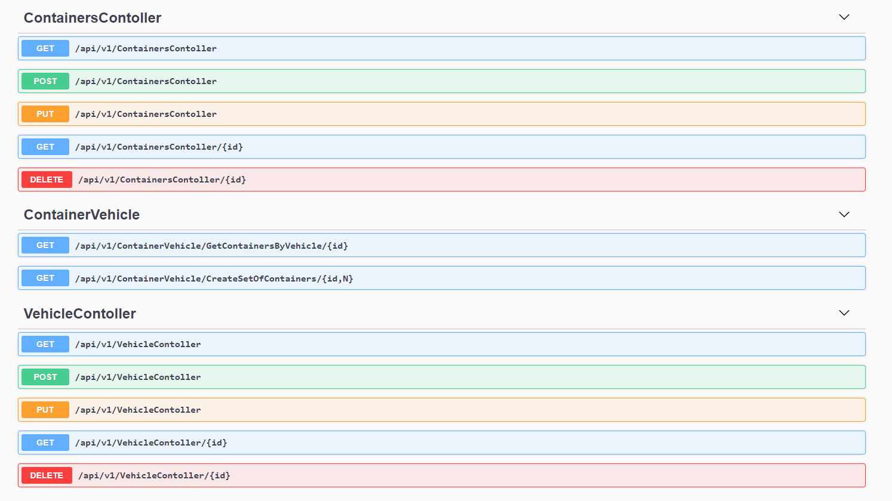

# assignment-3-serhatuluc

Libraries and Technologies
===============================

* PostgreSQL 14.0
* Serilog 5.0.0
* FluentNHibernate 3.1.0
* Nhibernate 5.3.12

Creation Of Database
===============================
Check here for sql queries needed to create database. -->
[SqlQueries](https://github.com/195-Patika-Dev-Paycore-Net-Bootcamp/assignment-3-serhatuluc/blob/main/sqlqueries.md)

Repositories
===============================
Repositories are modified to have similar methods like EF has such as getAll, getById, Update, Delete. Also it provides more readable controller by removing try catch and transaction statements.--> [Repositories](https://github.com/195-Patika-Dev-Paycore-Net-Bootcamp/assignment-3-serhatuluc/tree/main/PycApi/DataAccess/Concrete)

Apis
===============================

