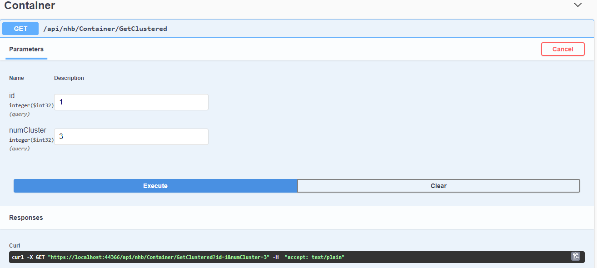
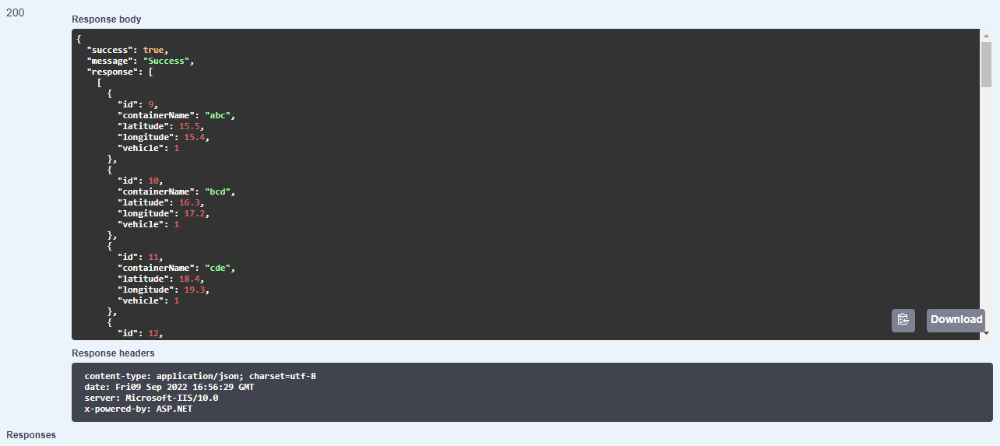

# assignment-4-serhatuluc
assignment-4-serhatuluc created by GitHub Classroom

K-Means Implementation
--------------------------------------------------------------
K-Means algorithm is preferred to be used to cluster containers. Algorithm is implemented as an extension of double[ ][ ].Check here ->[K-Means Extension](https://github.com/195-Patika-Dev-Paycore-Net-Bootcamp/assignment-4-serhatuluc/blob/main/PycApi.Service/KMeansExtension.cs)

Service
------------------------------------------------------------
Extension is used in a service which works for container. Check here ->[Container Service](https://github.com/195-Patika-Dev-Paycore-Net-Bootcamp/assignment-4-serhatuluc/blob/main/PycApi.Service/Container/Concrete/ContainerService.cs)

Controller
----------------------------------------------------------------
This is how it looks in controller. Check here ->[Container Controller](https://github.com/195-Patika-Dev-Paycore-Net-Bootcamp/assignment-4-serhatuluc/blob/main/PycApi/Controllers/ContainerController.cs)

Sql Queries
---------------------------------------------------
Prepared sql queries can be used to test the code. Queries are meant to create three cluster of points. If 3 cluster for contaner with id = 1  is requested then result 
can be easily checked. Check here -> [Sql Queries](https://github.com/195-Patika-Dev-Paycore-Net-Bootcamp/assignment-4-serhatuluc/blob/main/query.sql)

Screenshots
----------------------------------------------------------

